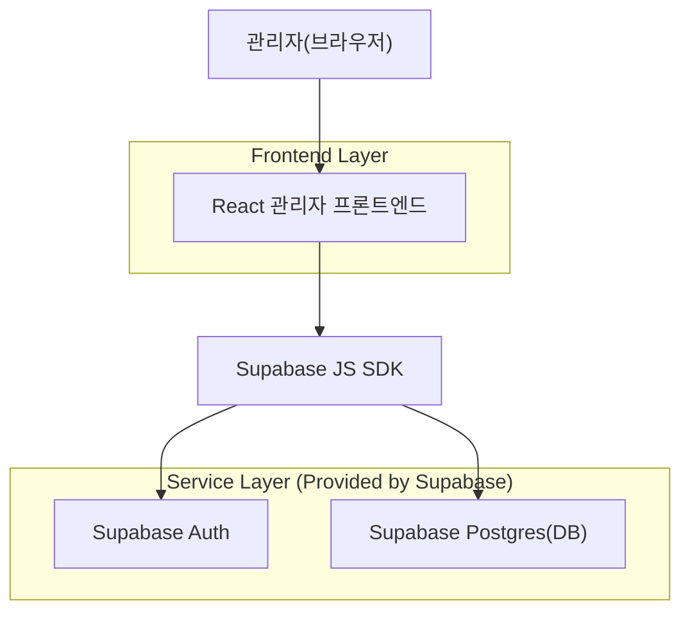
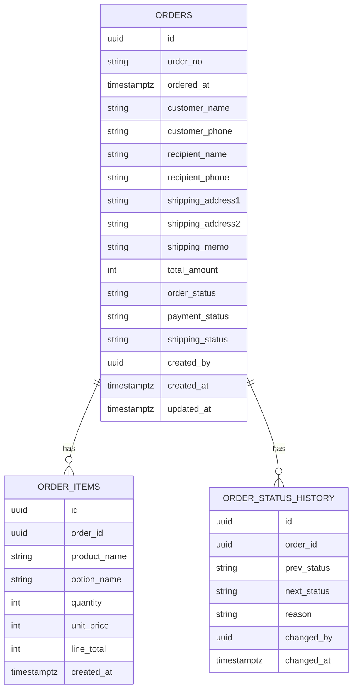

## 1.Architecture design


## 2.Technology Description
- Frontend: React@18 + TypeScript + (선택) tailwindcss@3
- Backend: Supabase (Auth + Postgres + PostgREST/RPC)

## 3.Route definitions
| Route | Purpose |
|-------|---------|
| /admin/login | 관리자 로그인 및 세션 시작 |
| /admin/orders | 주문 목록(검색/필터/정렬/페이지네이션) |
| /admin/orders/:orderId | 주문 상세 조회 및 상태 변경 |

## 4.API definitions (If it includes backend services)
### 4.1 공통 TypeScript 타입(프론트에서 사용)
```ts
export type OrderStatus =
  | 'pending'
  | 'paid'
  | 'preparing'
  | 'shipped'
  | 'delivered'
  | 'cancelled'
  | 'refunded';

export type PaymentStatus = 'unpaid' | 'paid' | 'refunded';
export type ShippingStatus = 'none' | 'preparing' | 'shipped' | 'delivered';

export type Order = {
  id: string; // uuid
  order_no: string;
  ordered_at: string; // timestamptz
  customer_name: string;
  customer_phone: string;
  recipient_name: string;
  recipient_phone: string;
  shipping_address1: string;
  shipping_address2: string | null;
  shipping_memo: string | null;
  total_amount: number;
  order_status: OrderStatus;
  payment_status: PaymentStatus;
  shipping_status: ShippingStatus;
  created_at: string;
  updated_at: string;
};

export type OrderItem = {
  id: string;
  order_id: string;
  product_name: string;
  option_name: string | null;
  quantity: number;
  unit_price: number;
  line_total: number;
};
```

### 4.2 데이터 접근(API) 설계 (Supabase PostgREST/RPC 기준)
- 주문 목록 조회(검색/필터/정렬/페이지네이션)
  - 테이블: `orders`
  - Query 개념
    - 기간: `ordered_at` between
    - 상태: `order_status`, `payment_status`, `shipping_status`
    - 키워드: `order_no` / `customer_name` / `recipient_name` / `customer_phone` / `recipient_phone` (ilike)
    - 정렬: `ordered_at desc` 기본
    - 페이지: range(from, to)

- 주문 상세 조회
  - 테이블: `orders`, `order_items`, `order_status_history`
  - `orders.id = :orderId`로 단건 조회 + 연관 목록(order_items, history) 조회

- 주문 상태 변경(원자적 처리 권장)
  - RPC: `change_order_status(p_order_id uuid, p_next_status text, p_reason text)`
  - 동작: (1) 전이 규칙 검증 (2) orders 업데이트 (3) status_history 추가

## 6.Data model(if applicable)
### 6.1 Data model definition


### 6.2 Data Definition Language
> 주의: 초기 단계 단순화를 위해 **물리 FK는 두지 않고**, `order_id` 등은 논리 키로만 사용한다.

```sql
-- orders
CREATE TABLE IF NOT EXISTS orders (
  id UUID PRIMARY KEY DEFAULT gen_random_uuid(),
  order_no TEXT UNIQUE NOT NULL,
  ordered_at TIMESTAMPTZ NOT NULL DEFAULT now(),

  customer_name TEXT NOT NULL,
  customer_phone TEXT NOT NULL,
  recipient_name TEXT NOT NULL,
  recipient_phone TEXT NOT NULL,
  shipping_address1 TEXT NOT NULL,
  shipping_address2 TEXT,
  shipping_memo TEXT,

  total_amount INT NOT NULL DEFAULT 0,
  order_status TEXT NOT NULL,
  payment_status TEXT NOT NULL,
  shipping_status TEXT NOT NULL,

  created_by UUID,
  created_at TIMESTAMPTZ NOT NULL DEFAULT now(),
  updated_at TIMESTAMPTZ NOT NULL DEFAULT now()
);

CREATE INDEX IF NOT EXISTS idx_orders_ordered_at ON orders(ordered_at DESC);
CREATE INDEX IF NOT EXISTS idx_orders_status ON orders(order_status, payment_status, shipping_status);
CREATE INDEX IF NOT EXISTS idx_orders_order_no ON orders(order_no);
CREATE INDEX IF NOT EXISTS idx_orders_customer_name ON orders(customer_name);
CREATE INDEX IF NOT EXISTS idx_orders_recipient_name ON orders(recipient_name);

-- order_items
CREATE TABLE IF NOT EXISTS order_items (
  id UUID PRIMARY KEY DEFAULT gen_random_uuid(),
  order_id UUID NOT NULL,
  product_name TEXT NOT NULL,
  option_name TEXT,
  quantity INT NOT NULL,
  unit_price INT NOT NULL,
  line_total INT NOT NULL,
  created_at TIMESTAMPTZ NOT NULL DEFAULT now()
);
CREATE INDEX IF NOT EXISTS idx_order_items_order_id ON order_items(order_id);

-- status history
CREATE TABLE IF NOT EXISTS order_status_history (
  id UUID PRIMARY KEY DEFAULT gen_random_uuid(),
  order_id UUID NOT NULL,
  prev_status TEXT NOT NULL,
  next_status TEXT NOT NULL,
  reason TEXT,
  changed_by UUID,
  changed_at TIMESTAMPTZ NOT NULL DEFAULT now()
);
CREATE INDEX IF NOT EXISTS idx_order_status_history_order_id ON order_status_history(order_id, changed_at DESC);

-- 권한/보안: 관리자 전용을 전제로 RLS 활성화
ALTER TABLE orders ENABLE ROW LEVEL SECURITY;
ALTER TABLE order_items ENABLE ROW LEVEL SECURITY;
ALTER TABLE order_status_history ENABLE ROW LEVEL SECURITY;

-- 예시: 관리자는 app_metadata.is_admin=true 인 사용자만 허용(구현 방식에 맞춰 조정)
-- (1) 읽기: 관리자만
CREATE POLICY "admin_read_orders" ON orders
  FOR SELECT TO authenticated
  USING ((auth.jwt() -> 'app_metadata' ->> 'is_admin') = 'true');

CREATE POLICY "admin_read_order_items" ON order_items
  FOR SELECT TO authenticated
  USING ((auth.jwt() -> 'app_metadata' ->> 'is_admin') = 'true');

CREATE POLICY "admin_read_order_history" ON order_status_history
  FOR SELECT TO authenticated
  USING ((auth.jwt() -> 'app_metadata' ->> 'is_admin') = 'true');

-- (2) 업데이트: 상태 변경은 RPC를 통해서만 허용하는 구성을 권장
-- 직접 UPDATE를 막고, RPC 함수에 SECURITY DEFINER + 내부 검증으로 처리하는 패턴

-- 권한 부여(관리자용 테이블은 anon에 권한을 주지 않음)
GRANT SELECT, INSERT, UPDATE, DELETE ON orders TO authenticated;
GRANT SELECT, INSERT, UPDATE, DELETE ON order_items TO authenticated;
GRANT SELECT, INSERT, UPDATE, DELETE ON order_status_history TO authenticated;
```

> 상태 변경 RPC(요약)
```sql
-- 실제 운영에선 전이 규칙(예: cancelled 이후 shipped 불가) 등을 여기서 검증
CREATE OR REPLACE FUNCTION change_order_status(
  p_order_id uuid,
  p_next_status text,
  p_reason text
) RETURNS void
LANGUAGE plpgsql
SECURITY DEFINER
AS $$
DECLARE
  v_prev text;
BEGIN
  SELECT order_status INTO v_prev FROM orders WHERE id = p_order_id FOR UPDATE;
  IF v_prev IS NULL THEN
    RAISE EXCEPTION 'order not found';
  END IF;

  UPDATE orders
    SET order_status = p_next_status,
        updated_at = now()
  WHERE id = p_order_id;

  INSERT INTO order_status_history(order_id, prev_status, next_status, reason, changed_by)
  VALUES (p