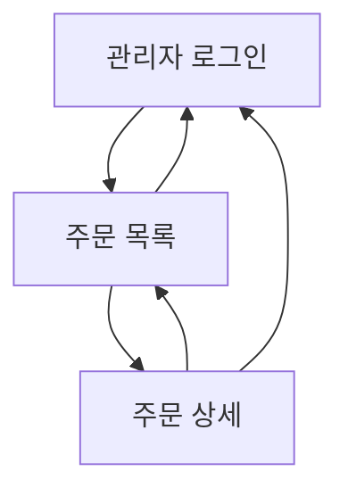

## 1. Product Overview
관리자가 주문을 조회하고(목록/상세), 검색·필터로 빠르게 찾고, 주문 상태를 변경할 수 있는 백오피스 화면 요구사항을 정의한다.
운영 효율(검색/정렬/이력)과 변경 안전성(권한/검증)을 우선한다.

## 2. Core Features

### 2.1 User Roles
| Role | Registration Method | Core Permissions |
|------|---------------------|------------------|
| 관리자 | 사전에 발급된 관리자 계정으로 로그인 | 주문 목록/상세 조회, 조건 검색·필터, 주문 상태 변경 |

### 2.2 Feature Module
주문 관리 요구사항은 다음의 최소 페이지로 구성된다:
1. **관리자 로그인**: 로그인 폼, 세션 유지/만료 처리.
2. **주문 목록**: 검색·필터, 정렬, 페이지네이션, 주문 요약 리스트.
3. **주문 상세**: 주문/고객/결제/배송 정보, 상품 라인아이템, 상태 변경.

### 2.3 Page Details
| Page Name | Module Name | Feature description |
|-----------|-------------|---------------------|
| 관리자 로그인 | 로그인 | 이메일/비밀번호로 로그인하고 성공 시 주문 목록으로 이동 |
| 관리자 로그인 | 세션 처리 | 로그인 유지, 만료 시 재로그인 유도 |
| 주문 목록 | 검색 | 키워드로 주문번호/주문자명/수령자명/연락처(부분일치) 검색 |
| 주문 목록 | 필터 | 기간(주문일), 주문상태, 결제상태, 배송상태(또는 배송단계)로 필터링 |
| 주문 목록 | 정렬·페이지네이션 | 주문일 최신순 기본, 상태/금액/주문일 정렬 및 페이지 이동 |
| 주문 목록 | 목록 표시 | 주문번호, 주문일시, 주문자, 총액, 상태 요약, 상세 진입 제공 |
| 주문 상세 | 요약 정보 | 주문번호/일시/총액, 주문·결제·배송 상태를 한눈에 표시 |
| 주문 상세 | 고객·배송 정보 | 주문자/수령자, 연락처, 배송지, 배송 메모 등 표시 |
| 주문 상세 | 상품 정보 | 상품명/옵션(있다면)/수량/단가/소계 라인아이템 표시 |
| 주문 상세 | 상태 변경 | 주문 상태를 선택하고 저장(필요 시 사유 입력), 실패 시 메시지 표시 |
| 주문 상세 | 변경 이력 | 상태 변경 일시/변경자/변경 전후 상태를 타임라인 또는 테이블로 표시 |

## 3. Core Process
- 관리자 로그인 플로우: 관리자는 관리자 로그인 페이지에서 인증 → 성공 시 주문 목록으로 이동 → 세션 만료 시 로그인으로 되돌림.
- 주문 탐색 플로우: 관리자는 주문 목록에서 키워드 검색 및 기간/상태 필터 적용 → 정렬/페이지 이동으로 대상을 좁힘 → 특정 주문을 선택해 상세로 진입.
- 상태 변경 플로우: 관리자는 주문 상세에서 현재 상태를 확인 → 변경할 상태를 선택하고 저장 → 시스템은 권한/전이 규칙을 검증하고 저장 → 성공 시 상세 화면이 갱신되고 변경 이력이 추가됨.

