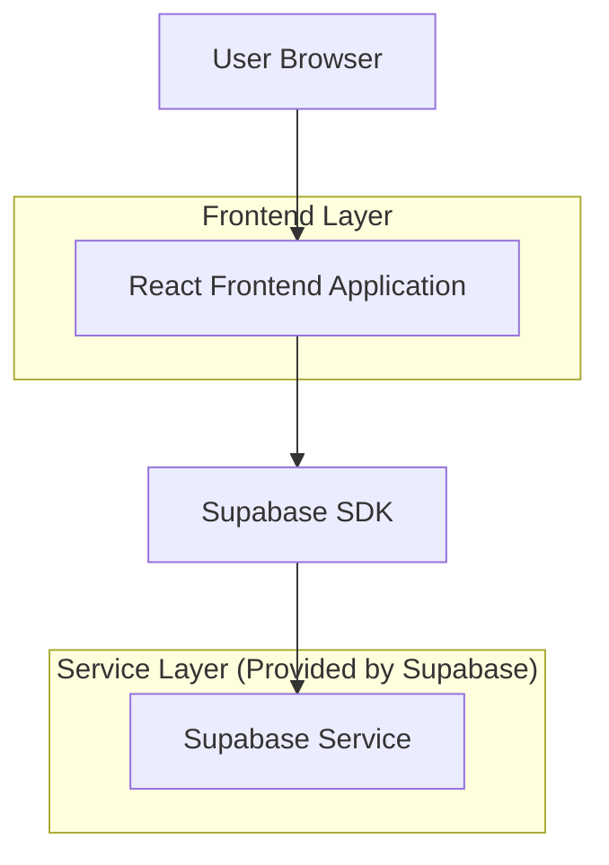
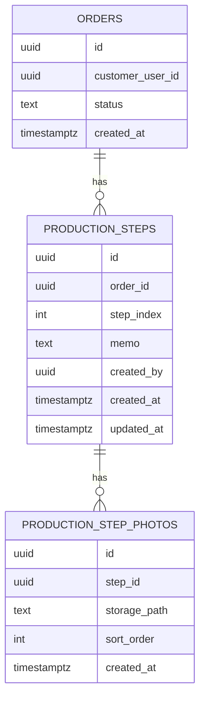

## 1.Architecture design


## 2.Technology Description
- Frontend: React@18 + TypeScript + (기존 라우터/상태관리 사용) + tailwindcss(또는 기존 스타일 시스템)
- Backend: Supabase (Auth + PostgreSQL + Storage)

## 3.Route definitions
| Route | Purpose |
|-------|---------|
| /login | 로그인 및 세션 생성 |
| /orders | 주문 목록 조회(주문상세 번호 클릭 진입점) |
| /orders/:orderId | 주문 상세 및 제작 단계 타임라인(고객 조회/관리자 편집) |

## 4.API definitions (Supabase 기반 논리 API)
### 4.1 Shared TypeScript Types
```ts
export type Order = {
  id: string;              // 주문상세 번호(노출)
  customer_user_id: string;
  status: string;
  created_at: string;
};

export type ProductionStep = {
  id: string;
  order_id: string;
  step_index: number;      // 1..n
  memo: string;            // 한줄 메모(최대 1줄)
  created_by: string;
  created_at: string;
  updated_at: string;
};

export type ProductionStepPhoto = {
  id: string;
  step_id: string;
  storage_path: string;    // Supabase Storage 경로
  sort_order: number;      // 1..n
  created_at: string;
};
```

### 4.2 Data Access (Client → Supabase)
- 주문 상세 조회
  - `orders`에서 `id = :orderId` 단건 조회
- 제작 단계 목록 조회
  - `production_steps`에서 `order_id = :orderId` 조건, `step_index` 오름차순
- 단계 생성/수정/삭제(관리자)
  - Insert/Update/Delete on `production_steps`
- 단계 사진 업로드/삭제/정렬(관리자)
  - Storage bucket에 업로드 후 `production_step_photos`에 메타데이터 insert
  - 삭제 시 `production_step_photos` row 삭제 + storage object 삭제

## 5.Server architecture diagram (If it includes backend services)
해당 범위는 별도 커스텀 서버 없이 Supabase(Auth/DB/Storage)만 사용한다.

## 6.Data model(if applicable)

### 6.1 Data model definition


### 6.2 Data Definition Language
> 물리 FK 제약은 두지 않고, `order_id`, `step_id`는 논리적으로 참조한다.

Production Steps (production_steps)
```
CREATE TABLE production_steps (
  id UUID PRIMARY KEY DEFAULT gen_random_uuid(),
  order_id UUID NOT NULL,
  step_index INTEGER NOT NULL,
  memo TEXT NOT NULL DEFAULT '',
  created_by UUID NOT NULL,
  created_at TIMESTAMP WITH TIME ZONE DEFAULT NOW(),
  updated_at TIMESTAMP WITH TIME ZONE DEFAULT NOW()
);

CREATE INDEX idx_production_steps_order_id ON production_steps(order_id);
CREATE UNIQUE INDEX uniq_production_steps_order_step ON production_steps(order_id, step_index);
```

Production Step Photos (production_step_photos)
```
CREATE TABLE production_step_photos (
  id UUID PRIMARY KEY DEFAULT gen_random_uuid(),
  step_id UUID NOT NULL,
  storage_path TEXT NOT NULL,
  sort_order INTEGER NOT NULL DEFAULT 1,
  created_at TIMESTAMP WITH TIME ZONE DEFAULT NOW()
);

CREATE INDEX idx_step_photos_step_id ON production_step_photos(step_id);
CREATE UNIQUE INDEX uniq_step_photos_step_sort ON production_step_photos(step_id, sort_order);
```

Storage
- Bucket: `order-production`
- Object path 예시: `orders/{order_id}/steps/{step_id}/{uuid}.jpg`

권한(권장 RLS 개요)
- 고객(Authenticated): 본인 주문에 속한 `production_steps`, `production_step_photos` 조회만 허용
- 관리자/제작자(Authenticated + role claim 또는 별도 테이블): insert/update/delete 허용

권한(가이드라인에 따른 기본 GRANT 예시)
```
GRANT SELECT ON production_steps TO anon;
GRANT ALL PRIVILEGES ON production_steps TO authenticated;
GRANT SELECT ON production