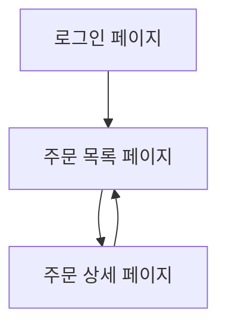

## 1. Product Overview
주문 상세 화면에서 제작 진행 상황을 단계별로 기록(사진 여러 장 + 한줄 메모)하고, 고객이 주문상세 번호를 클릭해 진행 상황을 조회할 수 있게 한다.
제작 커뮤니케이션을 주문 단위로 표준화해 문의/오해를 줄이고 신뢰를 높인다.

## 2. Core Features

### 2.1 User Roles
| Role | Registration Method | Core Permissions |
|------|---------------------|------------------|
| 고객 | 로그인(기존 방식) | 본인 주문 목록/상세 조회, 제작 단계 조회(읽기 전용) |
| 관리자/제작자 | 로그인(기존 방식) | 주문 상세에서 제작 단계 생성/수정/삭제, 단계별 사진 업로드/정렬 |

### 2.2 Feature Module
요구사항은 다음 핵심 페이지로 구성된다:
1. **로그인 페이지**: 사용자 인증, 접근 제어.
2. **주문 목록 페이지**: 본인 주문 목록 조회, 주문상세 번호 클릭으로 상세 이동.
3. **주문 상세 페이지**: 주문 기본 정보 조회, 제작 단계 타임라인(관리자 편집/고객 조회).

### 2.3 Page Details
| Page Name | Module Name | Feature description |
|-----------|-------------|---------------------|
| 로그인 페이지 | 로그인 폼 | 이메일/비밀번호(또는 기존 인증 방식)로 로그인하고 세션을 유지한다. |
| 주문 목록 페이지 | 주문 리스트 | 주문을 목록으로 표시하고 **주문상세 번호 클릭** 시 주문 상세로 이동한다. |
| 주문 상세 페이지 | 주문 기본 정보 | 주문상세 번호, 상태, 고객/수령 정보 등 핵심 필드를 조회한다. |
| 주문 상세 페이지 | 제작 단계 타임라인(조회) | 단계 순서대로 카드/타임라인으로 표시한다. 각 단계는 **한줄 메모**와 **사진 여러 장**을 갤러리로 보여준다. |
| 주문 상세 페이지 | 제작 단계 관리(관리자) | 단계를 추가/수정/삭제한다. 단계 순서를 변경한다(위/아래 이동). 단계마다 한줄 메모를 입력한다. |
| 주문 상세 페이지 | 단계 사진 관리(관리자) | 단계에 사진을 여러 장 업로드한다. 업로드된 사진을 미리보기로 확인하고 삭제한다. 사진 표시 순서를 변경한다(드래그 또는 ↑↓). |
| 주문 상세 페이지 | 권한/노출 분기 | 고객은 읽기 전용으로만 보며, 관리자 UI(추가/수정/삭제/업로드)는 숨긴다. |

## 3. Core Process
### 고객 플로우
1) 로그인한다. 2) 주문 목록에서 **주문상세 번호**를 클릭한다. 3) 주문 상세에서 제작 단계 타임라인과 단계별 사진/메모를 확인한다.

### 관리자/제작자 플로우
1) 로그인한다. 2) 주문 목록에서 주문을 선택한다. 3) 주문 상세에서 제작 단계를 추가하고 한줄 메모를 작성한다. 4) 각 단계에 사진을 여러 장 업로드/정렬한다. 5) 필요 시 단계/사진을 수정 또는 삭제한다.

